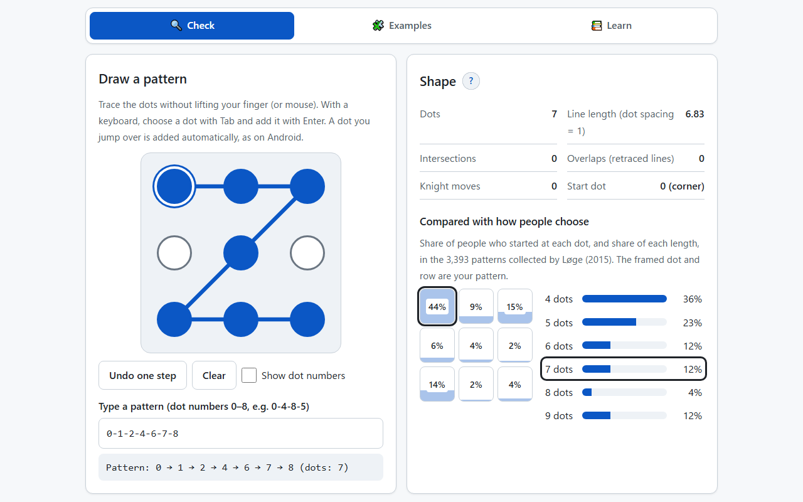
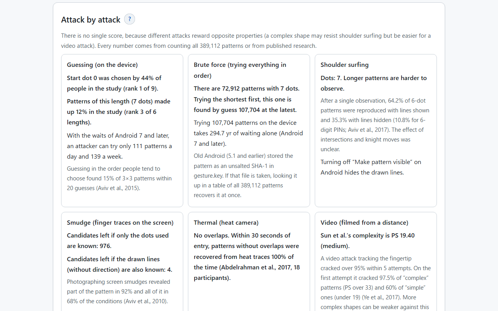
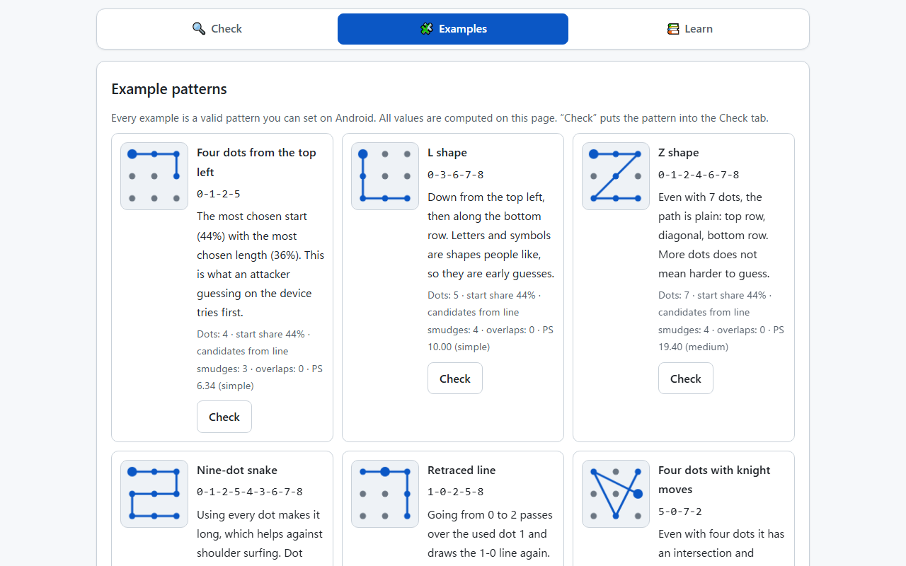
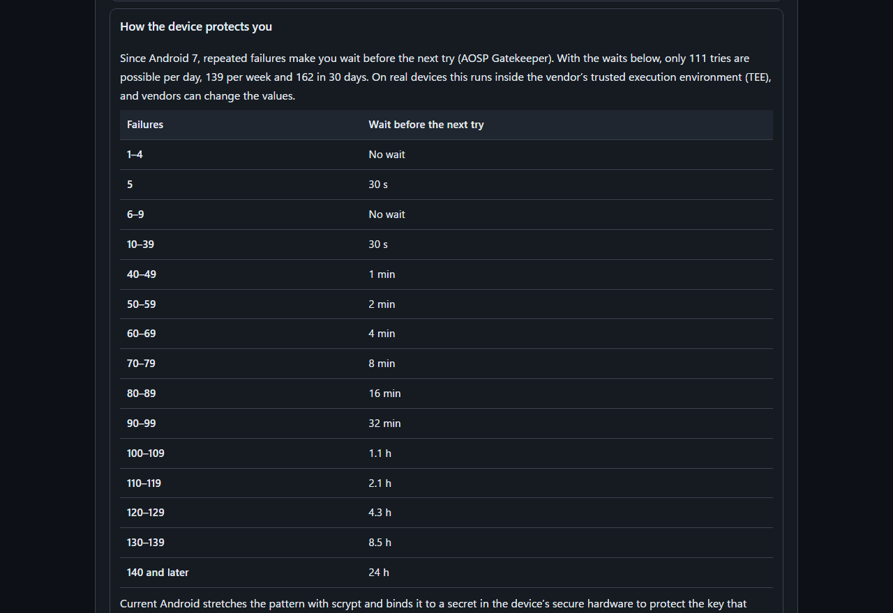
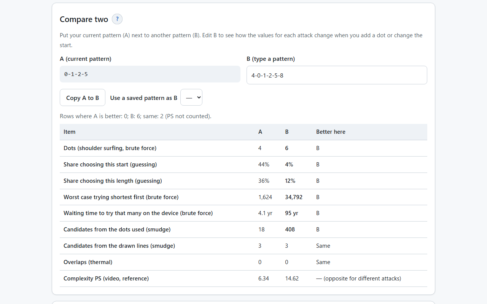
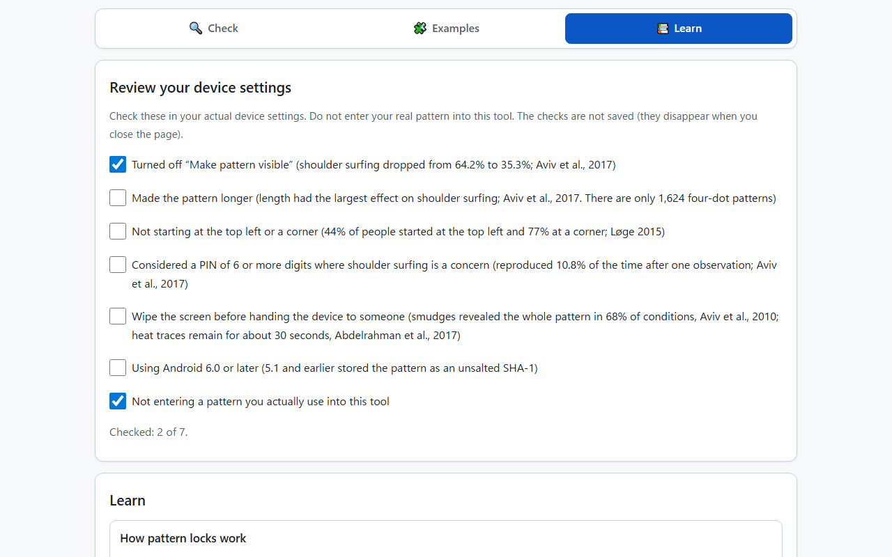

English · [日本語](README.md)


[](https://ipusiron.github.io/patternlock-security-trainer/)

**Day064 - 100 Security Tools with Generative AI**

# PatternLock Security Trainer - Android Pattern Lock Security Analyzer

Draw an Android 3×3 unlock pattern and see how it fares against each attack: guessing, brute force, shoulder surfing, smudge, thermal and video.

Every number comes from an exact count of all 389,112 patterns that the Android rules allow, or from published research. There is no single score, because different attacks reward opposite properties.

---

## 🌐 Demo

👉 **[https://ipusiron.github.io/patternlock-security-trainer/](https://ipusiron.github.io/patternlock-security-trainer/)**

You can try it directly in your browser.

---

## 📸 Screenshots

>
>
>*A Z shape (0-1-2-4-6-7-8). The top-left start dot was chosen by 44% of people in the study and is framed in the chart*

>
>
>*The same pattern attack by attack: only 139 tries a week on the device, line smudges narrow it to 4 candidates, and more*

>
>
>*Example patterns. Each one is a valid pattern on Android, and the values are computed on the page*

>
>
>*“How the device protects you” in the Learn tab: the waits of Android 7 and later (dark mode)*

>
>
>*Four dots from the top left (A) compared with six dots from the center (B). Each row shows which one costs the attacker more*

>
>
>*“Review your device settings” in the Learn tab: seven items with research values, to check on your actual device*

---

## ✨ Features

### 🔍 Draw or type a pattern

- Trace the nine dots (as on Android, each new press starts a new pattern). With a keyboard, choose a dot with Tab and add it with Enter
- Type a pattern (dot numbers 0–8: `0-4-8-5`, `0485`, full-width digits also work)
- A dot you jump over is added automatically if it is not used yet (the Android rule). “Undo one step” removes an automatically added dot together with the step
- Shows the shape: dots, line length, intersections, overlaps, knight moves and start dot

### ⚔️ Attack by attack

- Guessing: compares the start dot and length with the shares in the 3,393 patterns collected by Løge (2015), and shows how many tries the waits of Android 7 and later allow per day and per week
- Brute force: the number of patterns of the same length, the worst case when trying the shortest first, and the time it takes on the device
- Shoulder surfing, smudge, thermal and video: research values next to the values of this pattern (candidates left from smudges, overlaps, Sun et al.’s complexity)
- For reference, the complexity measure PS of Sun et al. (2014) and where it stands among all 389,112 patterns

### 🧩 Examples and 📚 Learn

- Examples: eight valid patterns (four dots from the top left, L shape, Z shape, nine-dot snake, retraced line, knight moves, center start, most complex shape). “Check” puts the pattern into the input
- Learn: how pattern locks work, how the device protects you, how people choose, attacks that observe the pattern, tips for choosing and for building. Links to 12 sources

### ⚖️ Compare two

- Puts your current pattern (A) next to another one (B), typed or picked from saved patterns, with the values for each attack
- Each row shows which one costs the attacker more (a smaller share of people is better; more candidates, guesses, waiting time, dots and overlaps are better). Complexity PS gets no mark, because it works in opposite directions for different attacks
- Edit B to see what changes when you add a dot or change the start

### ✅ Device settings checklist

- In the Learn tab, seven items to check on your actual device (hide the drawn lines, length, start dot, PIN, wiping the screen, Android 6.0 or later, not entering your real pattern), each with research values. The checks are not saved

### 💾 Save

- Saves only the name and the dot sequence in the browser (the values are recomputed every time). Nothing is saved until you press “Save”

### 🖥️ Screen

- Japanese and English (the initial language is taken from `?lang=` in the URL, then the saved choice, then the browser language; switching keeps the input and state)
- Light and dark modes (following the OS setting, with a button to switch)
- Tabs can be switched by clicking, with the left and right arrow keys, and with Home and End. `#tab=examples` or `#tab=learn` in the URL opens that tab
- No horizontal overflow even on a 320 px wide smartphone. Help opens in a dialog from the `?` buttons
- Works when `index.html` is opened directly as a file (`file://`)

---

## 📖 Usage

1. Open the public version, or download the repository and open `index.html`
2. In the “Check” tab, trace the dots or type a pattern. Do not enter a pattern you actually use
3. In “Shape” and “Compared with how people choose”, see how common the start dot and length are
4. In “Attack by attack”, read the values for each kind of attack
5. In “Compare two”, add a dot to B or change its start to see the difference. Keep patterns you want to revisit with “Save”
6. Read the background in “Learn” and check the items of “Review your device settings” on your actual device

---

## 🔬 Technical notes

### Android rules and the count

- Trace a single stroke over the nine dots of a 3×3 grid. At least four dots, and a dot cannot be used twice
- If you jump over a dot that is not used yet, it is added automatically (a line to a dot two away horizontally, vertically or diagonally). You can pass over a used dot. A knight move adds nothing
- Counting every pattern these rules allow gives the following

| Length | Patterns | Worst case trying shortest first |
|---|---|---|
| 4 dots | 1,624 | 1,624 |
| 5 dots | 7,152 | 8,776 |
| 6 dots | 26,016 | 34,792 |
| 7 dots | 72,912 | 107,704 |
| 8 dots | 140,704 | 248,408 |
| 9 dots | 140,704 | 389,112 |

### Intersections, overlaps and complexity

- Intersections count how many times two non-adjacent lines cross or touch at a dot. Overlaps count how many times a line between two neighboring dots is drawn again. These follow the definitions of Golla et al. (2019)
- Sun et al.’s (2014) complexity is PS = dots × log₂(line length + intersections + overlaps), with the spacing of horizontally or vertically adjacent dots as 1. With these definitions, the range over all patterns is 6.340–46.807, the same as in the literature
- Ye et al. (2017) called patterns with a PS under 19 “simple” and over 33 “complex”

### Candidates left from smudges

- If only the set of dots used is known, every pattern using the same dots remains a candidate (for example, 40 for 0-1-2-5-8)
- If the drawn lines (without direction) are also known, fewer remain. 50.2% of all patterns are narrowed to one, and 90.3% to two or fewer

### Waits on the device (Android 7 and later)

These follow `ComputeRetryTimeout` in AOSP `system/gatekeeper/gatekeeper.cpp`. Only 111 tries per day, 139 per week and 162 in 30 days are possible.

| Failures | Wait before the next try |
|---|---|
| 1–4 | No wait |
| 5 | 30 s |
| 6–9 | No wait |
| 10–39 | 30 s |
| 40–49 | 1 min |
| 50–59 | 2 min |
| 60–69 | 4 min |
| 70–79 | 8 min |
| 80–89 | 16 min |
| 90–99 | 32 min |
| 100–109 | 1.1 h |
| 110–119 | 2.1 h |
| 120–129 | 4.3 h |
| 130–139 | 8.5 h |
| 140 and later | 24 h |

On real devices this runs inside the vendor’s trusted execution environment (TEE), so vendors can change the values. Old Android (4.4 to 5.1) stored the pattern as an unsalted SHA-1 in `/data/system/gesture.key`, so if the file is taken, a lookup in a table of all 389,112 patterns recovers it.

---

## 📚 Research values

### How people choose

| Source | What was studied | Top left | Corner | Center |
|---|---|---|---|---|
| Løge 2015 | 802 people, 3,393 patterns | 44% | 77% | 4% |
| Uellenbeck et al., 2013 | Real patterns (105 people) | 38% | 75% | 6% |

- Lengths in Løge (2015): 4 dots 36%, 5 dots 23%, 6 dots 12%, 7 dots 12%, 8 dots 4%, 9 dots 12%. The 100 most common patterns made up 42% of all patterns
- Guessing in the order people tend to choose found about 4% of the patterns made with security in mind within 10 guesses and about 9% within 30 (Uellenbeck et al., 2013). 20 guesses found 15% of 3×3 and 19% of 4×4 patterns (Aviv et al., 2015)

### Attacks

| Attack | Research value | Source |
|---|---|---|
| Smudge | Part of the pattern revealed in 92% and all of it in 68% of the conditions | Aviv et al., 2010 |
| Shoulder surfing | After one observation, 64.2% of 6-dot patterns reproduced with lines shown and 35.3% with lines hidden (10.8% for 6-digit PINs) | Aviv et al., 2017 |
| Video | Over 95% within 5 attempts. On the first attempt, 97.5% of “complex” and 60% of “simple” patterns | Ye et al., 2017 |
| Thermal | Within 30 seconds, 100% of patterns without overlaps and 16.67% of patterns with overlaps | Abdelrahman et al., 2017 |

### Example patterns

| Example | Pattern | Dots | Start share | Candidates from line smudges | Overlaps | PS (class) |
|---|---|---|---|---|---|---|
| Four dots from the top left | 0-1-2-5 | 4 | 44% | 3 | 0 | 6.34 (simple) |
| L shape | 0-3-6-7-8 | 5 | 44% | 4 | 0 | 10.00 (simple) |
| Z shape | 0-1-2-4-6-7-8 | 7 | 44% | 4 | 0 | 19.40 (medium) |
| Nine-dot snake | 0-1-2-5-4-3-6-7-8 | 9 | 44% | 4 | 0 | 27.00 (medium) |
| Retraced line | 1-0-2-5-8 | 5 | 9% | 4 | 1 | 12.92 (simple) |
| Four dots with knight moves | 5-0-7-2 | 4 | 2% | 2 | 0 | 11.79 (simple) |
| Starting from the center | 4-0-1-2-5-8 | 6 | 4% | 3 | 0 | 14.62 (simple) |
| One of the most complex shapes | 4-0-8-1-7-2-6-5-3 | 9 | 4% | 4 | 1 | 46.81 (complex) |

Visual complexity measures are reported to correlate poorly with how easily patterns are actually guessed (Golla et al., 2019). The research background and sources are in [SECURITY_RESEARCH.en.md](SECURITY_RESEARCH.en.md).

---

## 🎯 Use cases

### Security learning and training

- Information security classes: students draw patterns that are not their own, compare the start-dot bias with the device waits, and discuss whether length or the attempt limit is the core of the protection
- Company training: explain the risk of a lost smartphone by contrasting current devices (139 tries a week) with old ones (recovered at once from a hash table)
- Forensics and CTF learning: understand why an old Android gesture.key is recovered from a table of all patterns, starting from the total of 389,112

### Development and design

- People building lock screens or pattern authentication in apps can decide the minimum length, the failure limit and the hash by comparing them with the AOSP implementation
- Teams considering a strength meter can weigh the limits of visual complexity measures (Golla et al., 2019) against an example where a meter increased the guesses needed (Song et al., 2015)

### Education and research

- Math classes and personal projects: check with the length table that the jump rule cuts the 985,824 permutations of the nine dots down to 389,112
- A starting point for reading papers: follow the 12 sources in the Learn tab to the research on smudge, shoulder surfing, video and thermal attacks

### Everyday life and creative work

- Reviewing a family member’s smartphone settings: understand the principles with this tool, then decide on the device to make the pattern longer and turn off “Make pattern visible” (do not enter the real pattern into the tool)
- Props for puzzle and escape games: when making “a smartphone you unlock from finger traces on the screen”, check how many candidates line smudges leave to tune the difficulty
- Articles and teaching materials: the figures and numbers come with sources you can cite

The author does not intend this tool to encourage attacks.

---

## 🔒 Security and privacy

- Patterns are handled only inside the browser and are never sent anywhere. The meta CSP sets `connect-src 'none'` and allows no inline scripts or styles (no `unsafe-inline`)
- All strings are put on the page with `textContent`
- Nothing is saved until you press “Save”. Only the name (up to 50 characters) and the dot sequence are saved, and they are checked to be a valid pattern when read back
- No random numbers are used (no `Math.random`). No external libraries or CDNs
- GitHub Pages cannot set HTTP security headers (such as X-Frame-Options). Settings that a meta element ignores are not written

---

## ⚠️ Notes and limitations

- Do not enter a pattern you actually use
- Research values come from the conditions of each study (participants, distance, time, device) and do not apply to every situation
- The tool does not rank patterns in the order an attacker would guess them. No public dataset of patterns exists, and the totals in papers (start dot, length) are not enough to build such a ranking
- The device waits are those of the default AOSP implementation; vendors may change them
- The counting rules for intersections and overlaps could not be checked in Sun et al.’s (2014) original paper. The tool uses the definitions of Golla et al. (2019) and confirms that they reproduce the range of 6.340–46.807 in the literature

---

## 🧪 Tests

```bash
npm test
```

- Node.js 22 or later, no dependencies (`node:test`). Runs automatically in GitHub Actions on every push and pull request
- Checks the logic (Android rules, the count, intersections and overlaps, PS, smudge candidates, device waits, comparing two patterns), the HTML of the page (CSP, ids, labels, tabs), the Japanese and English strings, color contrast, line length, the tabs, and the tables of both READMEs
- The numbers in the README tables are recomputed from the logic by the tests

---

## 📁 Directory structure

```
patternlock-security-trainer/
├── .github/                # GitHub settings
│   └── workflows/          # GitHub Actions workflows
│       └── test.yml        # Runs npm test on push and pull request
├── assets/                 # Images
│   ├── en/                 # Screenshots for the English README
│   │   ├── screenshot.png  # Drawing and seeing the shape
│   │   ├── screenshot2.png # Attack by attack
│   │   ├── screenshot3.png # Examples
│   │   ├── screenshot4.png # Learn, dark
│   │   ├── screenshot5.png # Compare two
│   │   └── screenshot6.png # Device settings checklist
│   ├── screenshot.png      # Screenshot for the Japanese README (drawing and seeing the shape)
│   ├── screenshot2.png     # Screenshot for the Japanese README (attack by attack)
│   ├── screenshot3.png     # Screenshot for the Japanese README (examples)
│   ├── screenshot4.png     # Screenshot for the Japanese README (learn, dark)
│   ├── screenshot5.png     # Screenshot for the Japanese README (compare two)
│   └── screenshot6.png     # Screenshot for the Japanese README (device settings checklist)
├── js/                     # Scripts other than the page (plain scripts, work from file://)
│   ├── i18n.js             # Choosing and switching the language (Japanese, English)
│   ├── messages.js         # Strings shown on the page (Japanese, English)
│   ├── pattern-core.js     # Logic (rules, count, shape, PS, smudge, waits, research values)
│   ├── tabs.js             # Tab switching (arrow keys, Home, End, #tab= in the URL)
│   ├── theme-init.js       # Applies the theme first while loading
│   └── theme.js            # Light / dark switching
├── test/                   # Tests (node:test)
│   ├── contrast.test.js    # Color contrast and control sizes
│   ├── core.test.js        # Rules, count, intersections and overlaps, PS, smudge, waits
│   ├── format.test.js      # Line length, line endings, minimum line counts
│   ├── html.test.js        # CSP, element ids, labels, aria-live, tabs, help
│   ├── i18n.test.js        # Dictionary keys, no Japanese in English, initial language
│   ├── load.js             # Loads the scripts in js/ for the tests
│   ├── messages.test.js    # Where strings live, keys, numbers in strings
│   ├── readme.test.js      # Structure, tables, tree and images of both READMEs
│   └── tabs.test.js        # Tab switching and the tab opened from the URL
├── .gitignore              # Git ignore settings
├── .nojekyll               # Tells GitHub Pages not to use Jekyll
├── CLAUDE.md               # Development notes for Claude Code
├── LICENSE                 # License (MIT)
├── README.en.md            # This document
├── README.md               # Japanese document
├── SECURITY_RESEARCH.en.md # Research background and sources (English)
├── SECURITY_RESEARCH.md    # Research background and sources (Japanese)
├── index.html              # The page
├── package.json            # npm test settings (no dependencies)
├── script.js               # Page logic
└── style.css               # Styles (light, dark)
```

---

## 💻 Environment

- Checked on the latest Chrome, Edge and Firefox (320–1280 px wide, light and dark, HTTP and `file://`)
- Not checked on Safari or on real devices

---

## 📄 License

MIT License – see [LICENSE](LICENSE) for details.

---

## 🛠️ About this tool

This tool was developed as part of the "100 Security Tools with Generative AI" project.
The project creates and publishes a wide variety of security-related tools over 100 days with the help of AI.

For details about the project and other tools, see the following page.

🔗 [https://akademeia.info/?page_id=42163](https://akademeia.info/?page_id=42163)
