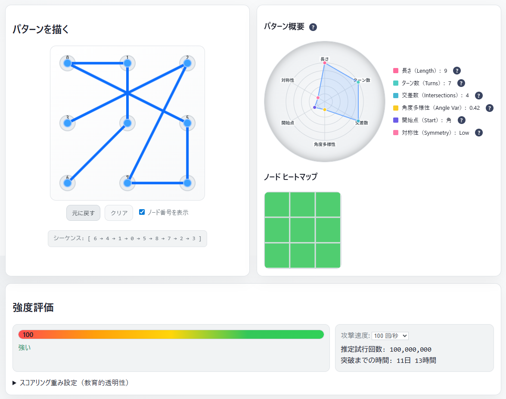

<!--
---
title: PatternLock Security Trainer
category: mobile-authentication
difficulty: 2
description: Analyze and train the security of Android-style 3×3 lock patterns.
tags: [pattern-lock, authentication, security, education, visualization, android]
demo: https://ipusiron.github.io/patternlock-security-trainer/
---
-->


[](https://ipusiron.github.io/patternlock-security-trainer/)

**Day064 - 生成AIで作るセキュリティツール100**


# PatternLock Security Trainer - パターンロック強度測定ツール

**PatternLock Security Trainer**は、Androidで広く使われる**3×3パターンロック**の強度を調査するためのツールです。

描いたパターンの **特徴量** を抽出し、**強度スコア**・**推定試行回数**・**突破までの時間目安** を可視化します。
人間が選びがちなバイアス（角から開始、直線・対称の好み等）が **推測容易性** に与える影響を体験的に理解できます。

## 📱 パターンロック固有の技術的背景

### なぜスマートフォンでパターンロックが普及したのか

パターンロックは**タッチスクリーン**という特殊なハードウェア特性を活かした認証方式です：

#### 📱 スマートフォンの技術的優位性
- **高精度タッチセンサー**: 連続的な指の動きを精密に追跡
- **大画面ディスプレイ**: 3×3グリッド（9点）の配置が可能
- **マルチタッチ対応**: 圧力・接触面積の検出でスワイプを認識
- **リアルタイム処理**: 軌跡の瞬時計算と視覚フィードバック

#### 🔒 物理的デジタル錠前との比較

| 特徴 | スマートフォン | 物理的デジタル錠前 |
|------|---------------|------------------|
| **入力方式** | タッチスクリーン | 物理ボタン |
| **パターン認証** | ✅ 可能（スワイプ軌跡検出） | ❌ 困難（連続動作を認識できない） |
| **主要認証方式** | パターン・PIN・生体認証 | テンキー式・生体認証・RFIDカード |
| **ハードウェア制約** | タッチパネルの精度 | ボタン配置・センサー種類 |

#### 🚪 物理錠前でパターン認証が少ない理由

1. **スワイプ検出の困難性**
   - 物理ボタンは「押下」のみ検出、連続的な「軌跡」は認識不可
   - スワイプ用のタッチパッドを搭載するとコスト・故障リスクが増大

2. **環境耐性の要求**
   - 屋外設置では防水・防塵・温度変化に対応が必要
   - タッチスクリーンは物理ボタンより環境耐性で劣る

3. **代替手段の優位性**
   - **テンキー式**: シンプル・確実・低コスト
   - **生体認証**: 指紋・顔・虹彩で高セキュリティ
   - **RFID/NFCカード**: 非接触・高速・管理しやすい

### 🔧 技術的実装の違い

#### スマートフォン（パターン対応）
```python
# タッチイベントの連続処理
touch_events = capture_continuous_touch()
pattern_sequence = analyze_touch_trajectory(touch_events)
authentication_result = verify_pattern(pattern_sequence)
```

#### 物理錠前（ボタン式）
```python
# 個別ボタン押下の検出
button_sequence = capture_button_presses()
pin_code = convert_to_digits(button_sequence)
authentication_result = verify_pin(pin_code)
```

この技術的制約により、パターンロックは**タッチスクリーン搭載デバイス特有の認証方式**として位置づけられています。

---

## 🌐 デモページ

👉 **[https://ipusiron.github.io/patternlock-security-trainer/](https://ipusiron.github.io/patternlock-security-trainer/)**

ブラウザーで直接お試しいただけます。

---

## 📸 スクリーンショット

>  
>*強度評価100点のロックパターン例*

>  
>*典型的なパターン例*

---

## ✨ 主な機能

- 🟩 **3×3パターン入力パッド**（マウス/タッチ対応、Undo/Clear、ノード番号表示切替）
- 📐 **特徴量抽出**：長さ、ターン数、交差数、角度多様性、開始点クラス（corner/edge/center）、対称性
- 📊 **レーダーチャート可視化**（パターンの特徴を6軸で直感的に表示）
- 🧮 **強度スコア**（0–100）＋ **重みスライダー**（教育用にスコアモデルの透明性を確保）
- ⏱️ **推定試行回数** と **突破時間の目安**（攻撃速度 10 / 100 / 1000 tries/sec を切替）
- 🔥 **ノード・ヒートマップ**（どのノードが使われたかを可視化）
- 💾 **保存＆比較**（複数パターンを `localStorage` に保存して A/B 比較）
- 🌓 **ダーク/ライトモード切替**（ユーザーの好みに応じたテーマ選択）
- 📚 **3タブシステム**（強度検査・パターン例・座学で整理された学習体験）
- 🎯 **アコーディオン式学習コンテンツ**（ユーザー・開発者・初学者向けヒント）
- 🛡️ **ブラウザー完結**（通信なし。個人データは保存しません）

---

## 📖 使用方法

### パターン強度検査タブ（メイン機能）

**パターンを描く**セクションで 3×3 のノードをドラッグしてパターンを描きます（重複ノード不可、スキップ時は中間ノードが自動挿入される Android ルール準拠）。描いたパターンのシーケンスがパッド下部に表示されます。

**パターン概要**では、レーダーチャートで6つの特徴量（長さ・ターン数・交差数・角度多様性・開始点・対称性）を視覚的に確認。各項目の？アイコンにホバーすると詳細説明が表示されます。

**ノード ヒートマップ**で使用ノードの偏りを確認。

**強度評価**では、強度スコア・推定試行回数・突破時間が表示されます。攻撃速度（10/100/1000 回/秒）は切替可能。スコアリング重み設定で各指標の寄与を調整できます（教育目的）。

**パターンの保存**でパターンを保存し、後から比較できます（保存先は localStorage）。

### パターン例タブ

脆弱・中程度・安全なパターンの典型例を3×3グリッドで視覚的に確認。各パターンの強度スコア範囲と特徴を学習できます。

### 座学タブ

アコーディオン式で3つのカテゴリ：
- **ユーザー向け**：安全なパターン作成のコツ
- **開発者向け**：実装時のセキュリティ考慮事項
- **セキュリティ初学者向け**：パターンロックの基礎知識

### テーマ切替

画面右上のボタンでダークモード⇔ライトモード切替。設定は自動保存されます。

---

## 📊 スコアリングモデル（ヒューリスティック）

### 🎯 スコアリングの仕組み

このツールでは、パターンの強度を **0〜100点** で評価します。これは教育用のヒューリスティック（経験的手法）であり、特定の攻撃モデルに対する理論的保証を与えるものではありませんが、一般的なパターンの脆弱性を理解するのに役立ちます。

### 📏 評価項目の詳細

#### 1. **長さ（Length）** - 基本スコア 40点
- **4点パターン**: 20点（最も一般的だが脆弱）
- **5点パターン**: 25点
- **6点パターン**: 30点（推奨最低レベル）
- **7点パターン**: 35点
- **8点パターン**: 40点（実用性と安全性のバランス）
- **9点パターン**: 40点（最大だが記憶が困難）

**なぜ重要？** 長いパターンほど可能な組み合わせ数が指数的に増加します。4点なら約3,000通り、8点なら約4,000万通りの可能性があります。

#### 2. **ターン数・角度多様性（Turns / Angle Diversity）** - 最大 20点
- 直線的な動き（一方向）: 0点
- 2〜3回の方向転換: 10〜15点
- 4回以上の複雑な動き: 20点

**なぜ重要？** 「L字」「コの字」など単純な形状は人間が好みがちで、攻撃者にとって予測しやすくなります。

#### 3. **交差数（Intersections）** - 最大 15点
- 交差なし: 0点
- 1回交差: 8点
- 2回以上交差: 15点

**なぜ重要？** 線が交わるパターンは視覚的に複雑で、他人が観察して覚えることが困難になります。

#### 4. **開始点バイアス（Start Bias）** - 減点要素
- **左上角（位置0）から開始**: -10点（44%のユーザーが選択）
- **その他の角から開始**: -5点
- **辺から開始**: -3点
- **中央から開始**: 減点なし（わずか8%のユーザーのみ）

**なぜ重要？** 人間には「左上から始める」という強いバイアスがあります。攻撃者はこの傾向を利用して効率的に攻撃できます。

#### 5. **対称性（Symmetry）** - 減点要素
- **完全対称**: -10点
- **部分対称**: -5点
- **非対称**: 減点なし

**なぜ重要？** 対称的なパターンは美しく記憶しやすい反面、人間が好む傾向があるため予測されやすくなります。

### 🔢 スコア計算式

```
最終スコア = 基本スコア（長さ） + ターン・角度ボーナス + 交差ボーナス
           - 開始点ペナルティ - 対称性ペナルティ

（0〜100点に正規化）
```

### 📊 強度レベルの目安

| スコア範囲 | 強度レベル | 説明 | 推奨度 |
|----------|---------|------|-------|
| **0〜24点** | 🔴 非常に脆弱 | 数分〜数時間で突破される可能性 | ❌ 使用禁止 |
| **25〜49点** | 🟠 脆弱 | 数時間〜数日で突破される可能性 | ⚠️ 要改善 |
| **50〜74点** | 🟡 普通 | 数日〜数週間の耐性 | ✅ 最低限OK |
| **75〜100点** | 🟢 強固 | 数ヶ月以上の耐性期待 | ⭐ 推奨 |

### ⚖️ スコアリングの重み調整

教育目的で、各評価項目の重要度を調整できます：
- **長さ重視**: パターンの組み合わせ数を最重要視
- **複雑性重視**: ターン数や交差を重要視
- **バイアス重視**: 人間の行動パターンからの逸脱を重要視

### ⚠️ 注意事項

- このスコアは**相対的な強度の目安**です
- 実際のセキュリティは、デバイスの制限（試行回数上限、ロックアウト時間）に大きく依存します
- **70点以上のパターンを推奨**しますが、定期的な変更も重要です
- **実際に使用中のパターンはこのツールで入力しないでください**

---

## ⏱️ 推定試行回数と時間

スコアから 推定試行回数（例：10¹〜10⁸）を滑らかに写像し、選択した攻撃速度（10 / 100 / 1000 tries/sec）での
突破時間の目安 を表示します。これは 教育的便宜 のための近似であり、実環境の
リトライ制限・バックオフ・ワイプ等のポリシーによって現実の耐性は大きく変わります。

---

## ⚠️ 既知の制限事項

スコアは教育用ヒューリスティックです。
研究コミュニティの知見を簡略化して提示しています。

ブラウザーや表示倍率によってはドラッグ精度に差が出ることがあります。

---

## 🔴 脆弱なパターンの特徴

統計的に推測されやすいパターンの共通点：

### 開始位置の偏り
- **44%のユーザーが左上角（位置0）から開始** - 最も狙われやすい
- 四隅からの開始は全体の約70%を占める
- 中央開始は意外に少ない（約8%）

### 形状の単純さ
- **直線パターン**：上段（0-1-2）、対角線（0-4-8）など
- **基本図形**：L字、コの字、Z字型
- **対称パターン**：人間が美しいと感じる形は予測されやすい

### 長さの傾向
- **4点パターンが約30%** - 最も一般的だが、最も脆弱
- 9点パターンは1%未満 - 複雑すぎて実用性に欠ける

---

## 🟢 安全性の高いパターン

### 安全なパターンの作り方

#### 1. 長さを増やす
- **最低6点以上**を推奨（4点の約100倍の強度）
- 8点なら理論上は十分な強度を確保

#### 2. 開始位置を工夫
- **辺や中央から開始**すると統計的に稀
- 特に中央（位置4）開始は推測されにくい

#### 3. 複雑な軌跡を描く
- **交差を含める**：線が交わるパターンは記憶・観察が困難
- **多方向ターン**：一方向の動きを避ける
- **非対称にする**：左右対称を避ける

#### 4. 実例（高強度パターン）
- 中央→右上→左下→右中→左上（交差あり・非対称）
- 辺→角→反対角→辺→中央（ジグザグ軌跡）

---

## 💡 パターンをうまく覚える方法

### 1. ストーリー記憶法
無意味な数字の羅列ではなく、**物語として覚える**：
- 「家(4)から学校(2)へ行き、公園(6)でお母さん(0)に会う」
- 地図や建物配置になぞらえる

### 2. 身体記憶の活用
- **指の動きで覚える**：音楽の指使いのように
- **リズムをつける**：一定のテンポで描く練習

### 3. 視覚的連想
- **アルファベット**：「N」「Z」「M」などの文字型
- **記号・マーク**：星型、稲妻型など覚えやすい形

### 4. 段階的練習
1. **ゆっくり確実に**：最初は速度より正確性
2. **目をつぶって練習**：触覚だけで描けるまで
3. **ストレス下での練習**：急いでいる時も正確に

### 5. 定期的な変更
- **3-6ヶ月に1回変更**：スマッジ攻撃対策
- **新パターンは段階的に**：急激な変更は混乱の原因

---

## 🔒 データとプライバシー

本ツールは **完全にブラウザー内** で動作し、入力したパターンを **ネットワーク送信しません**。

保存機能について：
- **自動保存はしません**
- **「パターンを保存」ボタン**を押した場合のみ、ブラウザーの localStorage に保存
- 保存データはいつでも「すべて削除」ボタンで削除可能
- 保存データはサニタイゼーション処理でセキュリティ検証済み

**重要**：それでも、実際に使用中のパターンは入力しないでください。学習用のサンプルでお試しください。

---

## 🔧 開発

### 技術スタック
- **HTML/CSS/JavaScript (Vanilla)** - フレームワーク不使用
- **Canvas API** - パターン描画・レーダーチャート・ヒートマップ
- **CSS Variables** - ダーク/ライトモードのテーマ切替
- **LocalStorage** - パターンデータの保存

### セットアップ
ビルドなし、index.html を開くだけで動作します。

### コード構成
- **index.html** - UI・説明・3タブシステム・アコーディオン式学習コンテンツ
- **style.css** - スタイル・ダーク/ライトモード対応・レスポンシブデザイン
- **script.js** - 入力処理・特徴量抽出・スコアリング・テーマ切替・保存機能

---

## 📁 ディレクトリー構成

```
patternlock-security-trainer/
├── assets/
│   ├── screenshot.png       # メインのスクリーンショット
│   └── screenshot2.png      # 追加のスクリーンショット
├── index.html               # メインのHTML（UI・説明・3タブシステム）
├── style.css                # スタイル（ダーク/ライトモード対応）
├── script.js                # 入力処理・特徴量抽出・スコアリング・保存・テーマ切替
├── README.md                # このファイル
├── CLAUDE.md                # Claude Code用プロジェクト説明
├── .htaccess                # Apache用セキュリティヘッダー設定
├── _headers                 # Netlify用セキュリティヘッダー設定
├── .nojekyll                # GitHub Pages用Jekyll無効化
└── .gitignore               # Git無視ファイル設定
```

---

## 🔢 数学的背景：パターン数の増大

### グリッドサイズと理論上の組み合わせ数

パターンロックの理論上の最大組み合わせ数は、グリッドサイズによって飛躍的に増大します：

#### 3×3 グリッド（9点）
```
最短4点：P(9,4) = 9!/(9-4)! = 9×8×7×6 = 3,024通り
最長9点：P(9,9) = 9! = 362,880通り

実際の組み合わせ数 = Σ(k=4 to 9) P(9,k) = 389,112通り
```

#### 4×4 グリッド（16点）
```
最短4点：P(16,4) = 16×15×14×13 = 43,680通り
最長16点：P(16,16) = 16! ≈ 2.09 × 10^13通り

実際の組み合わせ数 = Σ(k=4 to 16) P(16,k) ≈ 2.09 × 10^13通り
```

#### 5×5 グリッド（25点）
```
最短4点：P(25,4) = 25×24×23×22 = 303,600通り
最長25点：P(25,25) = 25! ≈ 1.55 × 10^25通り

実際の組み合わせ数 = Σ(k=4 to 25) P(25,k) ≈ 1.55 × 10^25通り
```

### 増大率の比較

| グリッド | 点数 | 理論上の組み合わせ数 | 増大率 |
|---------|------|-------------------|-------|
| 3×3 | 9点 | ~3.9 × 10^5 | 1倍 |
| 4×4 | 16点 | ~2.1 × 10^13 | ~5.4 × 10^7倍 |
| 5×5 | 25点 | ~1.6 × 10^25 | ~4.1 × 10^19倍 |

### 現実的な制約

ただし、実際のセキュリティではこれらの数値は以下の要因で大幅に減少します：

1. **人間の行動パターン**
   - 左上からの開始：44%のユーザー
   - 対称パターンの好み：約20%
   - 直線的な動き：約15%

2. **物理的制約**
   - 手の届く範囲での描画
   - 記憶しやすさの優先
   - 素早い入力の必要性

3. **アンドロイドルール**
   - スキップ時の中間ノード自動挿入
   - 重複ノード禁止

### 実効的なセキュリティ

```
効果的なパターン数 = 理論値 × 人間要因 × 物理要因

3×3: 389,112 × 0.1 × 0.3 ≈ 11,673通り
4×4: 2.1×10^13 × 0.05 × 0.2 ≈ 2.1×10^11通り
5×5: 1.6×10^25 × 0.02 × 0.1 ≈ 3.2×10^23通り
```

このため、グリッドサイズの拡張は理論上は飛躍的にセキュリティを向上させますが、実際の使用では人間の行動パターンによって大幅に制約されます。

---

## 💼 活用シナリオ

### 1. 個人ユーザー向け：パターン強度の確認とアドバイス

**シナリオ**：新しいスマートフォンを購入したユーザーが、パターンロックを設定する際に活用

**使用方法**：
1. 考えた候補パターンをツールに入力
2. レーダーチャートで視覚的に強度を確認
3. 「座学」タブでセキュリティのポイントを学習
4. 複数のパターンを「保存」機能で比較検討
5. 最終的に70点以上のパターンを採用

**効果**：直感的に「覚えやすい」パターンの多くが実際には予測されやすいことを理解し、より安全なパターンを選択できる。

### 2. セキュリティ教育・研修での実演ツール

**シナリオ**：企業のセキュリティ担当者が社員研修で活用

**使用方法**：
1. 研修参加者に「よくありそうなパターン」を挙げてもらう
2. 「パターン例」タブで脆弱なパターンの特徴を説明
3. 実際にパターンを入力して強度スコアを確認
4. 重み設定を調整してスコアリングモデルの透明性を説明
5. 「座学」タブでサーマル攻撃など最新の脅威を紹介

**効果**：抽象的だったセキュリティリスクが数値とビジュアルで具体化され、行動変容につながりやすい。

### 3. 開発者・研究者向け：パターンロック機能の設計検討

**シナリオ**：モバイルアプリ開発チームがパターンロック機能を実装する際の仕様検討

**使用方法**：
1. 現在の評価アルゴリズムをベースに、独自の評価基準を検討
2. 重み設定を調整して、アプリの用途に適したバランスを探る
3. 様々なパターンでテストし、ユーザビリティとセキュリティの両立点を発見
4. READMEの数学的背景を参考に、4×4や5×5グリッドの導入効果を検討
5. ソースコードを参考に、実装上の注意点（中間ノード自動挿入など）を確認

**効果**：理論と実装の両面から理解を深めることで、ユーザーフレンドリーでありながらセキュアなパターンロック機能を設計できる。

---

## 🗺️ ロードマップ

- 4×4 / 5×5など拡張グリッドへの対応
- 代表的な「弱パターン」テンプレとの類似度可視化
- ショルダーサーフィング耐性を想定した別視点（記憶しづらさ等）の併記
- スマホ表示のアクセシビリティ改善（タッチ半径、ハイコントラスト等）

---

## 📚 参考文献（詳細な学習のために）

### 一般向け参考文献
- Uellenbeck, S. et al. (2013). Quantifying the Security of Pattern Unlock.
- Andriotis, P. et al. (2013). A Pilot Study on the Security of Pattern Screen-lock Methods.
- Aviv, A.J. et al. (2010). Smudge Attacks on Smartphone Touch Screens.
- Bonneau, J. (2012). The Quest to Replace Passwords.

### 🎓 セキュリティ専門家向け詳細資料

パターンロックの脆弱性、攻撃手法、最新の研究動向について詳しく学びたい方は、以下の専門資料をご覧ください：

👉 **[SECURITY_RESEARCH.md](./SECURITY_RESEARCH.md)** - セキュリティ専門家向け詳細解説

**内容**:
- スマッジ攻撃、サーマル攻撃、センサーベース攻撃の詳細
- 機械学習・AIを活用した最新攻撃手法
- 防御技術とセキュリティ対策
- 脆弱性評価フレームワーク
- 2024年最新の研究動向
- 実装時のセキュリティベストプラクティス

---

## 📄 ライセンス

MIT License – 詳細は [LICENSE](LICENSE) を参照してください。

---

## 🛠 このツールについて

本ツールは、「生成AIで作るセキュリティツール100」プロジェクトの一環として開発されました。 
このプロジェクトでは、AIの支援を活用しながら、セキュリティに関連するさまざまなツールを100日間にわたり制作・公開していく取り組みを行っています。

プロジェクトの詳細や他のツールについては、以下のページをご覧ください。  

🔗 [https://akademeia.info/?page_id=42163](https://akademeia.info/?page_id=42163)
