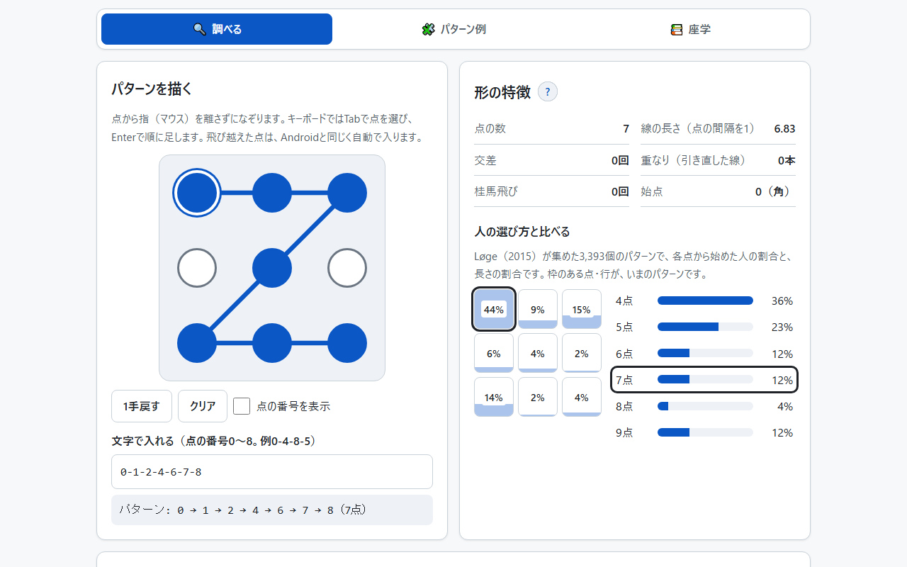
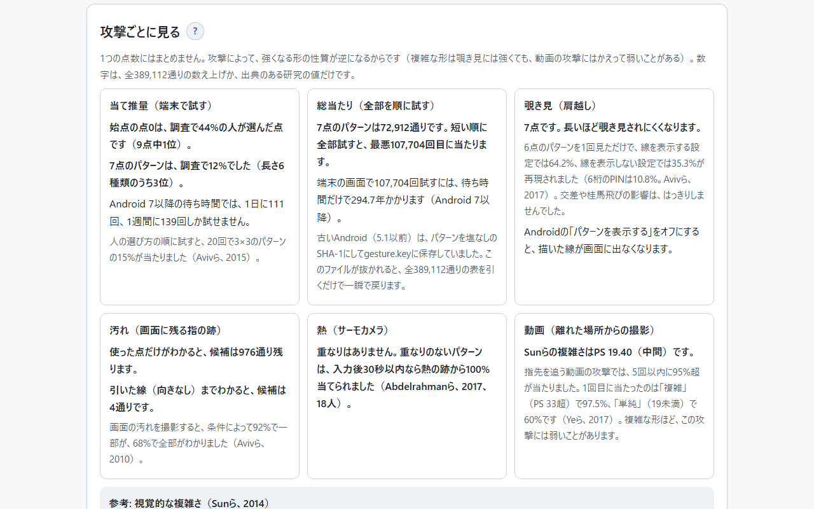
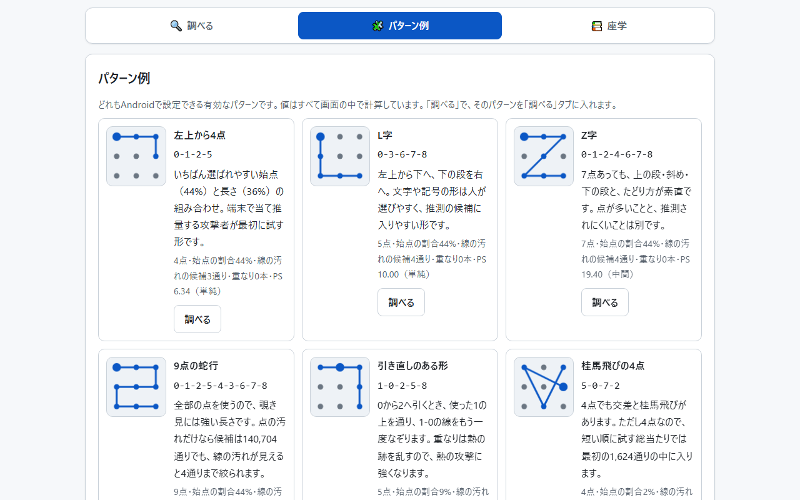
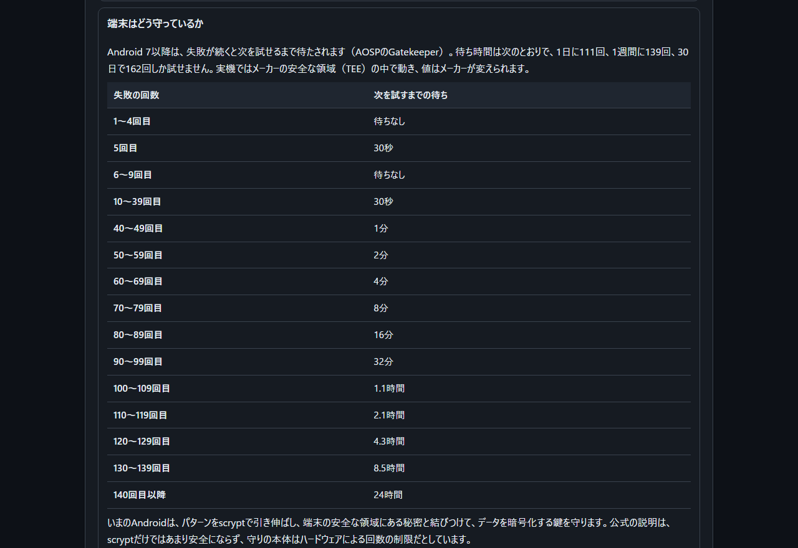

<!--
---
id: day064
slug: patternlock-security-trainer

title: "PatternLock Security Trainer"

subtitle_ja: "パターンロック強度測定ツール"
subtitle_en: "Android Pattern Lock Security Analyzer"

description_ja: "Android式の3×3パターンロックを、当て推量・総当たり・覗き見・汚れ・熱・動画の攻撃ごとに、全389,112通りの数え上げと出典のある研究の値で調べる教育ツール"
description_en: "Examine Android-style 3×3 unlock patterns attack by attack (guessing, brute force, shoulder surfing, smudge, thermal, video) using an exact count of all 389,112 patterns and published research"

category_ja:
  - モバイルセキュリティ
  - 認証
category_en:
  - Mobile Security
  - Authentication

difficulty: 4

tags:
  - pattern-lock
  - authentication
  - security
  - education
  - visualization
  - android
  - canvas
  - smudge-attack

repo_url: "https://github.com/ipusiron/patternlock-security-trainer"
demo_url: "https://ipusiron.github.io/patternlock-security-trainer/"

hub: true
---
-->


[](https://ipusiron.github.io/patternlock-security-trainer/)

**Day064 - 生成AIで作るセキュリティツール100**

# PatternLock Security Trainer - パターンロック強度測定ツール

Androidの3×3パターンロックを描くと、当て推量・総当たり・覗き見・汚れ・熱・動画の攻撃ごとに、そのパターンがどう見えるかを調べられるツールです。

数字は、Androidの規則で作れる全389,112通りの数え上げと、出典のある研究の値だけを使います。1つの点数にはまとめません。攻撃によって、強くなる形の性質が逆になるからです。

---

## 🌐 デモページ

👉 **[https://ipusiron.github.io/patternlock-security-trainer/](https://ipusiron.github.io/patternlock-security-trainer/)**

ブラウザーで直接お試しいただけます。

---

## 📸 スクリーンショット

>
>
>*Z字（0-1-2-4-6-7-8）を描いたところ。始点の左上は、調査で44%の人が選んだ点で、図の枠で示す*

>
>
>*同じパターンを攻撃ごとに見たところ。端末では1週間に139回しか試せないこと、線の汚れから候補が4通りに絞られることなどを並べる*

>
>
>*パターン例。どれもAndroidで設定できる有効なパターンで、値は画面の中で計算する*

>
>
>*座学の「端末はどう守っているか」。Android 7以降の待ち時間の表（ダークモード）*

---

## ✨ 機能

### 🔍 パターンを描く・入れる

- 9個の点をなぞって描く（Androidと同じく、押すたびに描き直す）。キーボードではTabで点を選び、Enterで順に足す
- 文字でも入れられる（点の番号0〜8。`0-4-8-5`、`0485`、全角の数字も可）
- まだ使っていない点を飛び越えると、その点を自動で入れる（Androidの規則）。「1手戻す」は、自動で入った点ごと戻す
- 形の特徴（点の数・線の長さ・交差・重なり・桂馬飛び・始点）を出す

### ⚔️ 攻撃ごとに見る

- 当て推量: 始点と長さを、Løge（2015）が集めた3,393個のパターンの割合と比べる。Android 7以降の待ち時間で、1日・1週間に試せる回数を出す
- 総当たり: 同じ長さのパターンの数と、短い順に全部試したときの最悪の回数、それを端末で試すのにかかる時間
- 覗き見・汚れ・熱・動画: 研究の値と、このパターンの値（汚れから残る候補の数、重なりの数、Sunらの複雑さ）を並べる
- 参考として、Sunら（2014）の複雑さの指標PSと、全389,112通りの中の位置を出す

### 🧩 パターン例・📚 座学

- パターン例: 有効な8例（左上から4点・L字・Z字・9点の蛇行・引き直し・桂馬飛び・中央から・最も複雑な形）。「調べる」で入力に入れる
- 座学: 仕組み・端末の守り・人の選び方・盗み見る攻撃・選ぶとき・作るとき。出典12件にリンク

### 💾 保存して比べる

- 名前と点の並びだけをブラウザーに保存する（値は表示のたびに計算し直す）。保存は「保存」を押したときだけ

### 🖥️ 画面

- ライト／ダークモード（OSの設定に従い、ボタンでも切り替え）
- タブはクリック、左右の矢印キー、Home・Endで移れる。URLの`#tab=examples`・`#tab=learn`で開くタブを選べる
- 幅320pxのスマートフォンでも横にはみ出さない。ヘルプは`?`ボタンで開くダイアログ
- ファイルとして直接開いても（`file://`）動く

---

## 📖 使い方

1. 公開版を開くか、リポジトリーをダウンロードして`index.html`を開く
2. 「調べる」タブで、点をなぞるか、文字でパターンを入れる。実際に使っているパターンは入れない
3. 「形の特徴」と「人の選び方と比べる」で、始点と長さがどれだけ選ばれやすいかを見る
4. 「攻撃ごとに見る」で、攻撃の種類ごとの値を読む
5. 気になるパターンは「保存して比べる」で並べる。「パターン例」「座学」で背景を確かめる

---

## 🔬 技術的な説明

### Androidの規則と数え上げ

- 3×3の9点を一筆でなぞる。4点以上、同じ点は2回使えない
- まだ使っていない点を飛び越えると、その点が自動で入る（縦横・斜めに2つ離れた点への線）。使った点の上は通れる。桂馬飛びは何も入らない
- この規則で作れるパターンを全部数えると、次のとおりである

| 長さ | パターンの数 | 短い順に試したときの最悪の回数 |
|---|---|---|
| 4点 | 1,624 | 1,624 |
| 5点 | 7,152 | 8,776 |
| 6点 | 26,016 | 34,792 |
| 7点 | 72,912 | 107,704 |
| 8点 | 140,704 | 248,408 |
| 9点 | 140,704 | 389,112 |

### 交差・重なりと複雑さ

- 交差は、隣り合わない2本の線が交わるか、点で触れる回数。重なりは、前に引いた線（点と点の間の1区間）をもう一度通る回数。数え方はGollaら（2019）の定義である
- Sunら（2014）の複雑さはPS＝点の数×log₂（線の長さ＋交差＋重なり）。線の長さは、横・縦に隣り合う点の間を1とする。この定義で全パターンを数えると、範囲は文献と同じ6.340〜46.807になる
- Yeら（2017）は、PSが19未満を「単純」、33を超えるものを「複雑」とした

### 汚れから残る候補

- 使った点（の集合）だけがわかると、同じ点を使うパターンが候補に残る（例0-1-2-5-8は40通り）
- 引いた線（向きなし）までわかると、候補はさらに減る。全パターンのうち50.2%は1通りに決まり、90.3%は2通り以内になる

### 端末の待ち時間（Android 7以降）

AOSPの`system/gatekeeper/gatekeeper.cpp`の`ComputeRetryTimeout`のとおりです。1日に111回、1週間に139回、30日で162回しか試せません。

| 失敗の回数 | 次を試すまでの待ち |
|---|---|
| 1〜4回目 | 待ちなし |
| 5回目 | 30秒 |
| 6〜9回目 | 待ちなし |
| 10〜39回目 | 30秒 |
| 40〜49回目 | 1分 |
| 50〜59回目 | 2分 |
| 60〜69回目 | 4分 |
| 70〜79回目 | 8分 |
| 80〜89回目 | 16分 |
| 90〜99回目 | 32分 |
| 100〜109回目 | 1.1時間 |
| 110〜119回目 | 2.1時間 |
| 120〜129回目 | 4.3時間 |
| 130〜139回目 | 8.5時間 |
| 140回目以降 | 24時間 |

実機ではメーカーの安全な領域（TEE）の中で動くので、値はメーカーが変えられます。古いAndroid（4.4〜5.1）は、パターンを塩なしのSHA-1にして`/data/system/gesture.key`に保存していたので、ファイルが抜かれると全389,112通りの表を引くだけで戻ります。

---

## 📚 研究の値

### 人の選び方

| 出典 | 調べたもの | 左上から | 角から | 中央から |
|---|---|---|---|---|
| Løge 2015 | 802人・3,393個 | 44% | 77% | 4% |
| Uellenbeckら、2013 | 実際のパターン（105人） | 38% | 75% | 6% |

- Løge（2015）の長さの割合は、4点36%・5点23%・6点12%・7点12%・8点4%・9点12%。上位100個のパターンで全体の42%を占めた
- 人の選び方の順に推測すると、守りを意識して作ったパターンの約4%が10回で、約9%が30回で当たった（Uellenbeckら、2013）。20回で3×3の15%、4×4の19%が当たった（Avivら、2015）

### 攻撃

| 攻撃 | 研究の値 | 出典 |
|---|---|---|
| 汚れ | 条件によって92%で一部が、68%で全部がわかった | Avivら、2010 |
| 覗き見 | 6点のパターンを1回見て、線を表示する設定で64.2%、表示しない設定で35.3%が再現された（6桁のPINは10.8%） | Avivら、2017 |
| 動画 | 5回以内に95%超。1回目に当たったのは「複雑」97.5%、「単純」60% | Yeら、2017 |
| 熱 | 30秒以内なら、重なりのないパターンは100%、重なりのあるパターンは16.67% | Abdelrahmanら、2017 |

### パターン例

| 例 | パターン | 点 | 始点の割合 | 線の汚れの候補 | 重なり | PS（区分） |
|---|---|---|---|---|---|---|
| 左上から4点 | 0-1-2-5 | 4 | 44% | 3 | 0 | 6.34（単純） |
| L字 | 0-3-6-7-8 | 5 | 44% | 4 | 0 | 10.00（単純） |
| Z字 | 0-1-2-4-6-7-8 | 7 | 44% | 4 | 0 | 19.40（中間） |
| 9点の蛇行 | 0-1-2-5-4-3-6-7-8 | 9 | 44% | 4 | 0 | 27.00（中間） |
| 引き直しのある形 | 1-0-2-5-8 | 5 | 9% | 4 | 1 | 12.92（単純） |
| 桂馬飛びの4点 | 5-0-7-2 | 4 | 2% | 2 | 0 | 11.79（単純） |
| 中央から始める | 4-0-1-2-5-8 | 6 | 4% | 3 | 0 | 14.62（単純） |
| 最も複雑な形の1つ | 4-0-8-1-7-2-6-5-3 | 9 | 4% | 4 | 1 | 46.81（複雑） |

見た目の複雑さの指標は、実際の推測されやすさとの相関が低いと報告されています（Gollaら、2019）。研究の背景と出典は [SECURITY_RESEARCH.md](SECURITY_RESEARCH.md) にまとめています。

---

## 🎯 ユースケース

### セキュリティの学習・研修

- 情報セキュリティの授業: 学生が本物ではないパターンを描き、始点の偏りと端末の待ち時間を比べて、「長さ」と「回数の制限」のどちらが守りの中心かを話し合える
- 社内研修: スマートフォンを紛失したときのリスクを、いまの端末（1週間に139回）と古い端末（ハッシュの表で一瞬）の違いで説明できる
- 鑑識・CTFの学習: 古いAndroidのgesture.keyが、なぜ全パターンの表で戻るのかを、総数389,112通りから理解できる

### 開発・設計

- ロック画面やアプリのパターン認証を作る人が、最小の長さ・失敗回数の制限・ハッシュの選び方を、AOSPの実装と照らして決められる
- 強度メーターを付けるか迷うチームが、見た目の複雑さの指標の限界（Gollaら、2019）と、メーターで推測の回数が増えた例（Songら、2015）を比べられる

### 教育・研究

- 数学の授業や自由研究: 「飛び越えの規則があると、9点の順列の合計985,824通りが389,112通りに減る」ことを、長さ別の表で確かめられる
- 論文を読む入口: 座学の出典12件から、汚れ・覗き見・動画・熱の研究へたどれる

### 暮らし・創作

- 家族のスマートフォンの設定を見直すとき: このツールで原理を確かめてから、端末の上で長さを増やす・「パターンを表示する」をオフにする、と決められる（本物のパターンはツールに入れない）
- 謎解き・脱出ゲームの小道具: 「画面の指の跡から開けるスマートフォン」を作るとき、線の汚れから候補が何通りに絞れるかを確かめて、難しさを調整できる
- 記事・教材: 図と数字に出典がついているので、そのまま引用元を示せる

作者の意図は、攻撃の手順を勧めることではありません。

---

## 🔒 セキュリティとプライバシー

- パターンはブラウザーの中だけで扱い、どこにも送らない。meta CSPで`connect-src 'none'`、インラインのスクリプトとスタイルを許さない（`unsafe-inline`なし）
- 画面に入れる文字列はすべて`textContent`で入れる
- 保存は「保存」を押したときだけ。保存するのは名前（50字まで）と点の並びだけで、読み込むときに有効なパターンかを確かめる
- 乱数は使わない（`Math.random`なし）。外部のライブラリー・CDNなし
- GitHub Pagesでは、HTTPのセキュリティヘッダー（X-Frame-Optionsなど）を設定できない。metaでは無視される指定は書かない

---

## ⚠️ 注意と限界

- 実際に使っているパターンは入れないこと
- 研究の値は、それぞれの研究の条件（人数・距離・時間・端末）での値で、どの場面にも当てはまるわけではない
- 人の選び方の順に並べた「攻撃の順位」は出さない。公開されたパターンのデータセットがなく、論文の集計（始点・長さ）だけでは順位を作れないため
- 端末の待ち時間はAOSPの既定の実装の値で、メーカーが変えている場合がある
- 交差・重なりの数え方は、Sunら（2014）の原典では確かめられていない。Gollaら（2019）の定義を使い、文献の範囲6.340〜46.807が再現することを確かめた

---

## 🧪 テスト

```bash
npm test
```

- Node.js 22以上、依存なし（`node:test`）。GitHub Actionsでpushとプルリクエストのたびに実行する
- 計算部（Androidの規則・数え上げ・交差と重なり・PS・汚れの候補・待ち時間）、画面のHTML（CSP・id・ラベル・タブ）、文言、配色のコントラスト、行の長さ、タブ、READMEの表を検証する
- READMEの表の数値は、テストで計算部から計算し直して照合する

---

## 📁 ディレクトリー構造

```
patternlock-security-trainer/
├── .github/                # GitHubの設定
│   └── workflows/          # GitHub Actionsのワークフロー
│       └── test.yml        # pushとプルリクエストでnpm testを実行
├── assets/                 # 画像
│   ├── screenshot.png      # スクリーンショット（描いて形の特徴を見る）
│   ├── screenshot2.png     # スクリーンショット（攻撃ごとに見る）
│   ├── screenshot3.png     # スクリーンショット（パターン例）
│   └── screenshot4.png     # スクリーンショット（座学・ダーク）
├── js/                     # 画面以外のスクリプト（通常のスクリプト、file://でも動く）
│   ├── i18n.js             # 画面の言語（日本語・英語）の決定と切り替え
│   ├── messages.js         # 画面に出す文言（日本語・英語）
│   ├── pattern-core.js     # 計算（規則・数え上げ・特徴・PS・汚れ・待ち時間・研究の値）
│   ├── tabs.js             # タブの切り替え（矢印キー・Home・End、URLの#tab=）
│   ├── theme-init.js       # 読み込みの最初にテーマを当てる
│   └── theme.js            # ライト／ダークの切り替え
├── test/                   # テスト（node:test）
│   ├── contrast.test.js    # 配色のコントラスト・操作の大きさ
│   ├── core.test.js        # 規則・数え上げ・交差と重なり・PS・汚れ・待ち時間
│   ├── format.test.js      # 行の長さ・改行コード・行数の下限
│   ├── html.test.js        # CSP・要素のid・ラベル・aria-live・タブ・ヘルプ
│   ├── i18n.test.js        # 日英の辞書のキー・英語に日本語がないこと・初期の言語
│   ├── load.js             # js/のスクリプトをテストに読み込む
│   ├── messages.test.js    # 文言の置き場所とキー、文言の数字
│   ├── readme.test.js      # READMEの構成・表・ツリー・画像
│   └── tabs.test.js        # タブの切り替え・URLから開くタブ
├── .gitignore              # Gitの除外設定
├── .nojekyll               # GitHub PagesでJekyllを使わない指定
├── CLAUDE.md               # Claude Code向けの開発メモ
├── LICENSE                 # ライセンス（MIT）
├── README.md               # 本ドキュメント
├── SECURITY_RESEARCH.md    # 研究の背景と出典（専門家向け）
├── index.html              # 画面
├── package.json            # npm testの設定（依存なし）
├── script.js               # 画面の処理
└── style.css               # スタイル（ライト・ダーク）
```

---

## 💻 動作環境

- Chrome・Edge・Firefoxの最新版で確認（幅320〜1280px、ライト・ダーク、HTTPと`file://`）
- Safari・実機では確認していない

---

## 📄 ライセンス

MIT License – 詳細は [LICENSE](LICENSE) を参照してください。

---

## 🛠️ このツールについて

本ツールは、「生成AIで作るセキュリティツール100」プロジェクトの一環として開発されました。
このプロジェクトでは、AIの支援を活用しながら、セキュリティに関連するさまざまなツールを100日間にわたり制作・公開していく取り組みを行っています。

プロジェクトの詳細や他のツールについては、以下のページをご覧ください。

🔗 [https://akademeia.info/?page_id=42163](https://akademeia.info/?page_id=42163)
